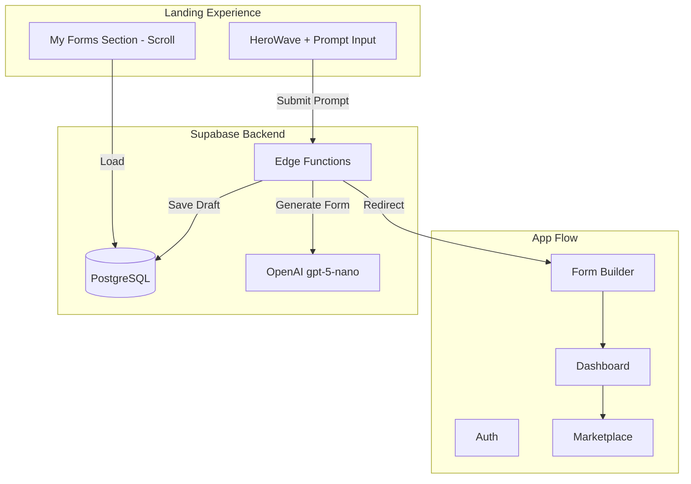
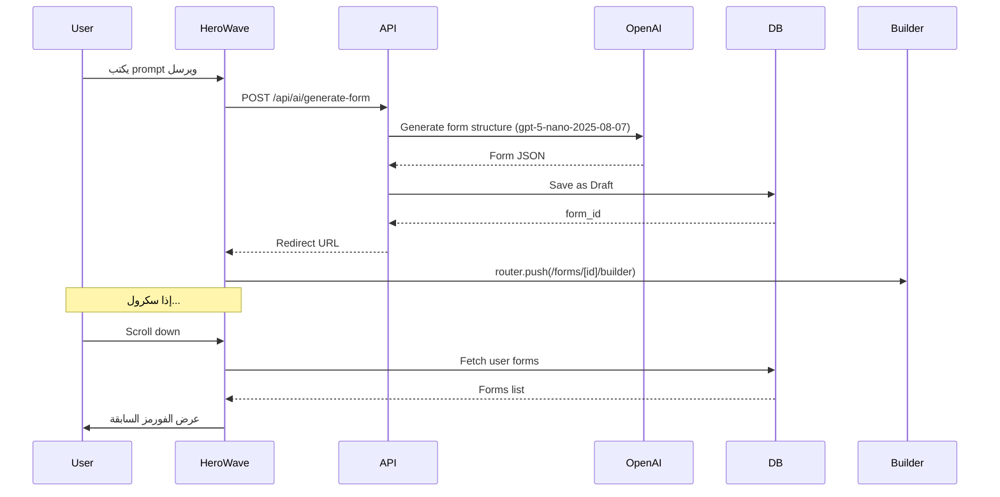

# Vibe Form - خطة البناء الكاملة (محدثة)

## نظرة عامة

بناء منصة **Vibe Form** - Micro SaaS لإنشاء الاستبيانات بالذكاء الاصطناعي مع Landing Page تفاعلية (HeroWave)، Marketplace للمجيبين، ونظام Credits.



---

## Stack التقني

| Component | Technology |

|-----------|------------|

| Framework | Next.js 15 (App Router) |

| Styling | Tailwind CSS + shadcn/ui |

| 3D/Animation | Three.js + GSAP |

| Backend | Supabase (DB جاهز) |

| AI | OpenAI gpt-5-nano-2025-08-07 via API Routes |

| i18n | next-intl (AR/EN + RTL) |

| State | Zustand + React Query |

| Forms | React Hook Form + Zod |

| Charts | Recharts |

| DnD | @dnd-kit |

---

## هيكل المشروع

```
src/
├── app/
│   ├── [locale]/
│   │   ├── page.tsx (Landing with HeroWave)
│   │   ├── (auth)/login, signup
│   │   ├── (dashboard)/
│   │   │   ├── forms/
│   │   │   │   ├── page.tsx (My Forms)
│   │   │   │   ├── new/page.tsx (Create from prompt)
│   │   │   │   └── [id]/
│   │   │   │       ├── builder/page.tsx
│   │   │   │       ├── analytics/page.tsx
│   │   │   │       └── settings/page.tsx
│   │   │   ├── feed/page.tsx
│   │   │   ├── credits/page.tsx
│   │   │   └── settings/page.tsx
│   │   └── f/[slug]/page.tsx (Public form)
│   └── api/
│       └── ai/generate-form/route.ts
├── components/
│   ├── ui/
│   │   ├── ai-input-hero.tsx (HeroWave)
│   │   ├── mini-navbar.tsx
│   │   └── ... (shadcn components)
│   ├── landing/
│   │   └── my-forms-section.tsx
│   ├── forms/
│   │   ├── question-types/
│   │   ├── builder-sidebar.tsx
│   │   └── form-preview.tsx
│   └── dashboard/
├── lib/
│   ├── supabase/
│   ├── ai/
│   └── utils/
├── locales/ (ar.json, en.json)
└── types/
```

---

## تدفق Landing Page الديناميكي



---

## المراحل التفصيلية

### المرحلة 1: Setup (الأساسيات)

- تهيئة Next.js 15 + Tailwind + TypeScript
- إعداد shadcn/ui (dark theme)
- تثبيت: `three`, `gsap`, `@types/three`
- تكامل Supabase Client + Types generation
- إعداد next-intl (AR/EN + RTL)

### المرحلة 2: Landing Page + HeroWave

**المكونات:**

- `components/ui/ai-input-hero.tsx` - HeroWave component
- `components/ui/mini-navbar.tsx` - Navbar component
- `components/landing/my-forms-section.tsx` - قسم الفورمز السابقة

**السلوك الديناميكي:**

```tsx
// app/[locale]/page.tsx
const handlePromptSubmit = async (prompt: string) => {
  // 1. Show loading state
  // 2. Call API to generate form
  // 3. Redirect to /forms/[newFormId]/builder
}
```

**قسم My Forms (عند السكرول):**

- Grid من الفورمز السابقة
- كل كارد يعرض: title, status, responses count, created_at
- زر "View" للـ Analytics و "Edit" للـ Builder
- Infinite scroll أو pagination

### المرحلة 3: Auth System

- Login/Signup pages (Email + OAuth)
- Middleware للحماية
- Auto-create profile on signup
- تعديل Navbar ليعرض حالة المستخدم

### المرحلة 4: AI Form Generation

**Model:** `gpt-5-nano-2025-08-07` (fast + cost-effective)

**API Route:**

```typescript
// POST /api/ai/generate-form
// Input: { prompt: string }
// Output: { formId: string, redirectUrl: string }

// Steps:
// 1. Validate user session
// 2. Call OpenAI gpt-5-nano-2025-08-07 with structured output
// 3. Parse response to form structure
// 4. Insert into forms + form_questions tables
// 5. Return formId for redirect
```

**OpenAI Configuration:**

```typescript
const response = await openai.chat.completions.create({
  model: "gpt-5-nano-2025-08-07",
  messages: [...],
  response_format: { type: "json_object" }
});
```

**Prompt Template:**

- System prompt يشرح الـ form structure
- Output: JSON with title, description, questions[]
- كل سؤال: type, title, description, required, options

### المرحلة 5: Form Builder UI

- Sidebar: قائمة الأسئلة + Add question
- Main area: تحرير السؤال المحدد
- Drag & Drop لترتيب الأسئلة
- Question types components
- Live Preview panel
- Publish/Save Draft buttons
- Settings (visibility, target_responses)

### المرحلة 6: Public Form (Respondent)

- صفحة `/f/[slug]` عامة
- Progress bar
- Question-by-question أو صفحة كاملة
- Submit + Thank you page
- Events tracking (view, start, submit)
- Credits award logic

### المرحلة 7: Dashboard + Analytics

- Overview cards
- Charts (Recharts)
- Responses table
- Export CSV
- AI Insights section

### المرحلة 8: Marketplace + Credits

- Feed page with tabs
- Answer & Earn flow
- Credits wallet
- Boost purchase

### المرحلة 9: Polish

- Loading states + Skeletons
- Error boundaries
- SEO + OG images
- Performance optimization
- Responsive design final pass

---

## ملفات المكونات الرئيسية

### HeroWave Component

الملف: `components/ui/ai-input-hero.tsx`

- Three.js wave animation
- Typing placeholder animation
- Form submission handler
- يستقبل `onPromptSubmit` callback

### Mini Navbar

الملف: `components/ui/mini-navbar.tsx`

- تعديل الروابط لتناسب Vibe Form
- إضافة حالة المستخدم (logged in/out)
- تعديل Logo

### My Forms Section

الملف: `components/landing/my-forms-section.tsx`

- Fetch forms من Supabase
- Grid layout
- Form cards with stats
- Empty state

---

## Supabase Integration Points

| Feature | Table | Operation |

|---------|-------|-----------|

| Generate Form | forms, form_questions | INSERT |

| My Forms | forms | SELECT with analytics |

| Save Draft | forms, form_questions | UPDATE |

| Publish | forms | UPDATE status |

| Submit Response | responses, response_answers | INSERT |

| Credits | credits_ledger, profiles | INSERT, UPDATE |

---

## Environment Variables Required

```env
NEXT_PUBLIC_SUPABASE_URL=https://gsfjwoskaabjjydsgwpd.supabase.co
NEXT_PUBLIC_SUPABASE_ANON_KEY=eyJhbGci...
OPENAI_API_KEY=sk-...
```